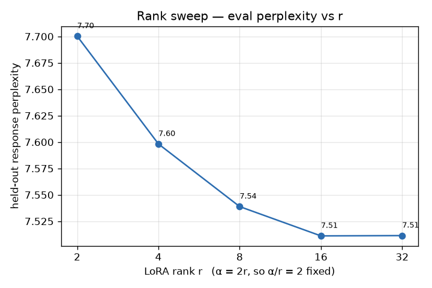
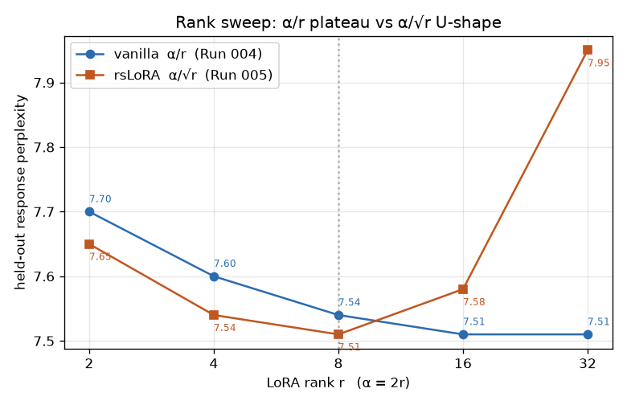
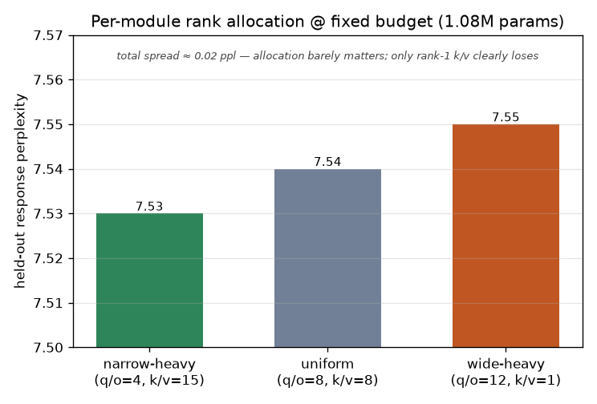

# Learning Journal

Append-only narrative of the LoRA Lab. Newest entries at the bottom.

---

## Session 0 — scaffold

- Set up the repo: uv project, Makefile, src/ layout, configs, docs, agents.
- Decided constraints: CPU-only (Ryzen 5 5650U, 14 GB RAM), plain LoRA on
  Qwen2.5-0.5B-Instruct, no local QLoRA.
- Defined four subagents: math-tutor, experiment-runner, doc-writer,
  code-reviewer.
- Open learning threads, in rough order:
  1. Derive the LoRA low-rank update from scratch (docs/math/01).
  2. Understand rank vs. alpha (docs/math/02).
  3. Fix loss masking — currently training on prompt tokens (docs/math/03 + code).
  4. Study QLoRA's NF4 / double quantization mathematically (docs/math/04).
  5. First training run + first experiment varying r.
- Next: open the repo in Claude Code, let it init git + uv, then pull the math
  thread first.

---

## Session 1 — git/uv init, LoRA derivation, first run

- Claude Code did the first-tasks list: `git init` (main) + scaffold commit,
  `make setup` (torch 2.12.0+cpu, transformers 5.12, peft/datasets/accelerate),
  walked the repo + Makefile, then I chose **math first, then a run**.
- Wrote `docs/math/01-lora-derivation.md` (via the math-tutor agent): full
  derivation of $W' = W_0 + \frac{\alpha}{r}BA$ — shapes, low-rank hypothesis,
  $B(Ax)$ forward + multiplication-order FLOPs, A-random/B-zero init (and the
  both-zero saddle), three α framings incl. rsLoRA, gradient flow + Adam memory,
  free merge. Three open empirical questions at the end.
- Ran `make train` on the baseline (branch `exp/01-baseline-r8`). The payoff:
  `trainable params: 1,081,344 (0.2184%)` matched a by-hand **GQA** decomposition
  to the exact parameter — q/o are 896², but k/v project to only 128 (2 KV heads
  × 64). The square-matrix estimate (~1.38M) overcounts by ~300k. Folded the
  verified numbers back into the doc (§1, §6) and added open-question #4: a single
  global $r$ is much looser capacity on the narrow k/v than on q/o.
- Numbers: loss 2.54 → ~1.91 (noisy, batch=1×8, 300 ex), 25m39s wall,
  **4.3 GB peak RAM**, 4.2 MB adapter. CPU-only LoRA on 0.5B is comfortable here.
- Things I learned / want to chase:
  - The optimizer-memory argument is the real reason this fits, not just param
    count — Adam $m,v$ only for the 1.08M trainable params (~8.6 MB).
  - **Loss masking gap** (src/train.py:75): we train on prompt+response, so the
    loss isn't a clean instruction signal. That's the next fix (docs/math/03).
- Next thread options: fix loss masking, or run the rank sweep for math/02.

---

## Session 2 — loss masking (spec → TDD → A/B)

- Pulled the loss-masking thread properly: brainstormed approaches, chose
  **Approach A** (manual prefix masking, no new deps), wrote the spec
  (`docs/math/03-loss-masking.md` + ADR 0003) and got it reviewed *before*
  touching code.
- Key math from 03: causal-LM loss with HF's internal label shift; `-100`
  changes the loss *denominator* (so masked/unmasked loss are NOT comparable);
  full-seq loss is a convex combo `|P|/(|P|+|R|)·L_P + |R|/(|P|+|R|)·L_R`, so
  training on the prompt spends a `|P|/(|P|+|R|)` slice of every gradient learning
  to generate the instruction (~80% for a 400/100 split).
- Built it **test-first**. The failing test caught a real surprise: transformers
  5.12 `apply_chat_template(tokenize=True)` returns a `BatchEncoding`, not a token
  list — needs `return_dict=True` + `["input_ids"]`. 7 tests pin the invariants
  (prompt masked, response unmasked, input_ids untouched, prompt-ids an exact
  prefix of full-ids, all-prompt example filtered). `src/data.py` holds the pure
  `build_example`; `train.py` swapped to `DataCollatorForSeq2Seq`.
- Run 002 (masked): dropped 3/300 examples (prompt ≥ max_len — the NaN guard),
  18m15s, 3.84 GB, train_loss 2.06 (not comparable to Run 001 — different
  denominator).
- **Honest result: inconclusive.** Compared *generations* (not loss) for masked
  vs unmasked: very similar. Masked obeyed "two sentences"; unmasked's haiku was
  a touch better. The confound: the base is already *Instruct*-tuned, so 300 ex /
  1 epoch of LoRA barely shifts behavior and the masking effect washes out. The
  fix is the right objective; this experiment just can't isolate its benefit.
- Lesson: eyeballing 3 greedy generations is a weak metric. Next time measure
  response-only eval loss on a held-out set (apples-to-apples), and/or pick a
  setup where the base is actually weak so there's signal to move.
- Next: a held-out eval harness, or the rank sweep (math/02).

---

## Session 3 — held-out eval harness

- Built the metric Run 002 was missing: `src/eval.py` + `make eval`, a
  response-only token-weighted NLL on a disjoint Dolly slice (`train[300:400]`).
  TDD'd the pure `weighted_mean` first (corpus mean, not mean-of-means; zero-token
  guard returns 0.0 not NaN). ADR 0004 records choosing the custom loop over
  `Trainer.evaluate()` (whose batch=1 eval_loss is mean-of-means).
- Three-way result (same 98 examples / 7821 response tokens, so comparable):
  base ppl 8.53 → Run 001 (unmasked) 7.55 → Run 002 (masked) **7.45**.
- **The metric earned its keep.** Eyeballing 3 generations (Session 2) said
  "no difference"; the token-weighted NLL shows masked beats unmasked by ΔNLL
  ≈ 0.013 (~1.3% ppl) — small but in the predicted direction, and both adapters
  clearly beat the base.
- Stayed honest: the gap is small, single-seed, and Run 002 trained on 297 vs
  300 examples — so I logged it as "directionally right, not yet attributable,"
  with the seed-controlled repeat as the way to actually prove it.
- Lesson reinforced: pick the metric before trusting the conclusion. The math
  (03 §2) said train loss wasn't comparable; eval NLL on a fixed denominator is.
- Next: seed-controlled masking repeat, or the rank sweep (math/02) — now there's
  a real number to plot against r.

---

## Session 4 — seed study: masking's edge is real

- Closed the masking question properly. Built a **paired** seed study
  (`src/study.py`, `make study`): per seed, train masked + unmasked with the
  *same* seed on the *same* 147 examples (made the all-prompt filter fire for
  both arms, killing the 297-vs-300 confound), then eval both. Added `seed` to
  the config + `set_seed` in a refactored `train(cfg)`. TDD'd `mean_std` and the
  unconditional-filter invariant (15 tests green). ADR 0005.
- Result across seeds 0,1,2 (held-out response-NLL): masked 2.0200 ± 0.0002 vs
  unmasked 2.0392 ± 0.0005. Paired delta **+0.0191 ± 0.0006, same sign every
  seed**. Masked ppl 7.54 vs 7.68 (~1.8%).
- **Masking genuinely helps** — the signal is ~30× the delta's spread and
  consistent across seeds, so it's not noise, and the confound is gone. The arc
  is the lesson: Session 2 eyeballed generations and saw "no difference";
  Session 3's token-weighted eval saw a hint (0.013); Session 4's paired study
  confirmed it (0.0191, tight). Better metric → clearer truth, each step.
- Stayed honest about limits: N=3 isn't a p-value; the case is "consistent sign +
  signal ≫ spread." Effect is small in absolute terms (instruct base + tiny
  data), and the math predicts a bigger gap when prompts dwarf responses.
- Surprise worth noting: seed variance is tiny (±0.0002) — fp32 CPU LoRA on fixed
  data is remarkably stable, which is why N=3 was already decisive.
- Next: rank sweep (math/02), with make study/make eval as the metric.

---

## Session 5 — rank sweep: low intrinsic rank confirmed

- Wrote `docs/math/02-rank-and-alpha.md` (math-tutor) as a **pre-registration**:
  rank = capacity (Eckart–Young), the plateau hypothesis + three curve readings,
  why sweep with α=2r (holding α/r=2 isolates capacity from effective-LR), and
  the linear compute cost of r. Deliberately kept results OUT of that doc.
- Built `src/sweep.py` / `make sweep` (TDD'd `make_sweep_configs`: α=2r invariant,
  distinct dirs, base not mutated — 20 tests green) + a committed matplotlib
  figure. ADR 0006. Added matplotlib (dev).
- Ran r∈{2,4,8,16,32}, α=2r, single seed, n=150 (~1h). Held-out response ppl:

  

  | r | 2 | 4 | 8 | 16 | 32 |
  |---|---|---|---|----|----|
  | ppl | 7.70 | 7.60 | 7.54 | 7.51 | 7.51 |

- **The prediction held: low intrinsic rank.** Monotonic drop that plateaus by
  r=16 (r=16 == r=32 to 4 dp). Most gain by r=8; r=16 a sliver more; r=32 nothing.
  No U-shape → no high-rank overfitting on this slice. So 01's open-question 1 is
  answered: r=8 is a sound default with headroom — the task's update really does
  live in a thin subspace, exactly the LoRA bet.
- Honest about it: the gains are small in absolute terms (7.70→7.51, ~2.5% total)
  — instruct base + tiny data again — and the α/r-vs-α/√r confound means the
  plateau could be partly a scaling artifact (rsLoRA sweep is the control). But
  the *shape* is the classic intrinsic-rank curve.
- Kept the pre-registration clean: results live here + in experiments/log.md
  (Run 004); math/02 only gained a one-line pointer. Registered-report style.
- Next: rsLoRA control sweep, per-module rank_pattern (01 OQ4), or a non-instruct
  base for stronger signal.

---

## Session 6 — rsLoRA control: the plateau was an artifact

- Ran the pre-registered control (math/02 §3): same sweep, α/√r scaling
  (`use_rslora=True`). Added the plumbing test-first (use_rslora propagation;
  22 tests green), verified PEFT honors it, then ran r∈{2,4,8,16,32}.

  

  | r | 2 | 4 | 8 | 16 | 32 |
  |---|---|---|---|----|----|
  | vanilla α/r | 7.70 | 7.60 | 7.54 | 7.51 | 7.51 |
  | rsLoRA α/√r | 7.65 | 7.54 | **7.51** | 7.58 | 7.95 |

- **The result flipped the nuance, and that's the payoff of running the control.**
  Run 004's flat plateau was partly a *scaling artifact*: vanilla α/r under-scales
  high-r adapters by ~1/√r, hiding overfitting. Under variance-correct α/√r the
  true curve is a **U-shape** — bottoms at r=8, then rises hard (r=32 → 7.95).
  More rank actively hurts on ~150 examples (overfitting), exactly reading (c)
  that §2 said was plausible for this data regime.
- r=8 is the optimum under *both* scalings, so the practical default is unchanged
  and now better-justified. But I had to walk back "r=8 has headroom" — the
  headroom was an illusion of under-scaling.
- Lesson (the recurring one): the control experiment earned its keep. Without it
  I'd have logged "low intrinsic rank, headroom to spare"; the truth is "r=8 is
  the knee, and the apparent headroom was a scaling artifact masking overfit."
- Honest limits: single seed (but the r=32 jump is ~300× seed noise, unambiguous);
  the U is a small-data phenomenon — more data would likely flatten the high-r rise.
- Next: per-module rank_pattern (01 OQ4), or a non-instruct base / more data to get
  effects bigger than the ~0.1–0.4 ppl range everything's been living in.

---

## Session 7 — per-module rank allocation: a clean negative result

- Answered 01 OQ4. Wired `rank_pattern`/`alpha_pattern` into train.py, built
  `src/allocation.py` / `make alloc`. Three **budget-matched** arms (all exactly
  1,081,344 params — verified live): uniform 8/8, wide-heavy q/o=12 k/v=1,
  narrow-heavy q/o=4 k/v=15, each α/r=2 per module. TDD'd (27 tests). ADR 0007.

  

  | arm | narrow-heavy | uniform | wide-heavy |
  |-----|---|---|---|
  | ppl | **7.53** | 7.54 | 7.55 |

- **My hypothesis was wrong, and that's the interesting part.** I expected the
  wide q/o matrices (rank 8 of 896 = 0.89%, vs k/v 8 of 128 = 6.25%) to be
  rank-starved, so wide-heavy should win. It came *last*. narrow-heavy edged it,
  wide-heavy (rank-1 k/v) lost. Total spread ~0.02 ppl — allocation barely matters;
  the only clear signal is *don't starve a module to rank 1*.
- The reconciliation taught me the real lesson: the "fraction of full matrix rank"
  intuition is the wrong lens. What matters is the intrinsic rank of each module's
  *update*, and the sweep already showed that's low (≤~8) everywhere. So q/o gains
  nothing from 12 (we knew r>8 plateaus), and k/v at rank 1 falls below its small
  need. Two experiments composing into one coherent picture.
- Honest: tiny effect, single seed (ordering above the ±0.0002 seed noise but
  small enough that a few seeds would firm it up), instruct base + tiny data.
  Verdict: keep uniform r=8 — per-module reallocation isn't worth it here.
- The recurring ceiling is now unmistakable: every result from Run 002 on lives in
  a ~0.02–0.4 ppl band because the base is already instruct-tuned and the data is
  tiny. Next real move is a weaker base / more data so experiments can be decisive.
